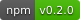

# archi-semantic-core

[](https://www.npmjs.com/package/@cda/archi-semantic-core) [](./LICENSE)

[](README.md) [](README.de.md) [](README.es.md) [](README.fr.md) [](README.nl.md) [](README.pt.md) [](README.zh.md)

Um parser em TypeScript para arquivos de modelo `.archimate` nativos criados
pelo editor de desktop [Archi](https://www.archimatetool.com/).

`archi-semantic-core` lê o formato XML nativo do Archi e o converte em um
`ArchiModel` limpo e fortemente tipado, contendo pastas, elementos,
relacionamentos, vistas, objetos de diagrama, conexões de diagrama, notas,
propriedades, estilo visual, Specializations/Profiles e os detalhes
semânticos nativos necessários para trabalhar com o modelo sem precisar
entender a estrutura XML do Archi. Ele também lê a variante em arquivo zip do
formato `.archimate`.

```text
.archimate XML  →  archi-semantic-core  →  ArchiModel
```

## Índice

- [Para que serve este pacote](#para-que-serve-este-pacote)
- [O que isto NÃO é](#o-que-isto-não-é)
- [Instalação](#instalação)
- [Uso](#uso)
- [API](#api)
  - [`parseArchiModel`](#parsearchimodelxml-string-archimodel)
  - [`validateArchiModel`](#validatearchimodelmodel-archimodel-archivalidationresult)
  - [`extractArchiModelXml`](#extractarchimodelxmlbytes-uint8array-string)
  - [`getLabelExpression`](#getlabelexpressionfeatures-archifeature-string--null)
  - [`resolveLabelExpression`](#resolvelabelexpressionmodel-archimodel-node-archidiagramobject--archidiagramconnection--archinote-string--null)
  - [Tipos públicos](#tipos-públicos)
- [Tipos brutos e semânticos](#tipos-brutos-e-semânticos)
- [Índices automáticos de contenção e conexão](#índices-automáticos-de-contenção-e-conexão)
- [Geometria: bounds e bendpoints](#geometria-bounds-e-bendpoints)
- [Semântica de Junction](#semântica-de-junction)
- [Atributos nativos específicos de relacionamentos](#atributos-nativos-específicos-de-relacionamentos)
  - [Access](#access)
  - [Influence](#influence)
  - [Association](#association)
- [Estilo visual](#estilo-visual)
- [Entradas nativas `<feature>` e Label Expressions](#entradas-nativas-feature-e-label-expressions)
- [Specializations e Profiles](#specializations-e-profiles)
- [Arquivos `.archimate` compactados (zip)](#arquivos-archimate-compactados-zip)
- [Validação](#validação)
- [O que é coberto](#o-que-é-coberto)
- [O que está fora do escopo](#o-que-está-fora-do-escopo)
- [Requisitos e formato de módulo](#requisitos-e-formato-de-módulo)
- [Desenvolvimento](#desenvolvimento)
- [Princípio de design](#princípio-de-design)
- [Licença](#licença)

## Para que serve este pacote

Use este pacote quando precisar trabalhar de forma programática com um modelo
do Archi, mantendo o parsing independente da renderização, edição, regras de
qualidade ou conversão para outros formatos de intercâmbio.

O parser se concentra em duas responsabilidades:

- preservar as informações nativas do Archi que pertencem ao modelo semântico;
- expor essas informações por meio de uma API TypeScript pequena e tipada.

Ele não reinterpreta o modelo para outro padrão.

## O que isto NÃO é

Este pacote analisa o formato **nativo** `.archimate` do Archi
(`xmlns:archimate="http://www.archimatetool.com/archimate"`) — o formato que o
próprio Archi lê e grava em disco.

**Não** é um parser nem um gerador do
[ArchiMate® Model Exchange File Format](https://www.opengroup.org/xsd/archimate/),
e não possui UI, editor, renderer ou motor de roteamento de diagramas.

Essas são responsabilidades distintas e pertencem a pacotes separados.

Este projeto não é afiliado nem endossado pelo Archi, pelo projeto Archi Tool
ou pelo The Open Group.

## Instalação

```sh
npm install @cda/archi-semantic-core
```

## Uso

```ts
import {
  parseArchiModel,
  validateArchiModel,
} from '@cda/archi-semantic-core';

const model = parseArchiModel(xml);

console.log(model.elements);
console.log(model.relationships);
console.log(model.views);

console.log(model.elements[0].type);
// p. ex. "ApplicationComponent", não "archimate:ApplicationComponent"

const { valid, errors } = validateArchiModel(model);
```

`parseArchiModel` aceita apenas texto XML. Ler um arquivo do disco, usar a
File API do navegador ou buscar XML pela rede é responsabilidade de quem
chama a função. Isso mantém o pacote utilizável a partir do Node.js, de
bundlers de navegador e de testes, sem acoplá-lo a um ambiente de E/S
específico.

O Archi também pode salvar um arquivo `.archimate` como um arquivo zip (ele
faz isso automaticamente sempre que o modelo tem imagens incorporadas). Leia
os bytes brutos e passe-os primeiro por `extractArchiModelXml` caso o arquivo
possa ter qualquer uma das duas formas:

```ts
import { readFileSync } from 'node:fs';
import { extractArchiModelXml, parseArchiModel } from '@cda/archi-semantic-core';

const bytes = readFileSync('MeuModelo.archimate');
const xml = extractArchiModelXml(bytes); // lida com XML puro ou um arquivo zip
const model = parseArchiModel(xml);
```

## API

### `parseArchiModel(xml: string): ArchiModel`

Analisa texto XML nativo do Archi e retorna um modelo semântico.

Lança uma exceção quando a entrada não é uma string ou o XML não está bem
formado.

### `validateArchiModel(model: ArchiModel): ArchiValidationResult`

Verifica a integridade estrutural de um modelo já analisado — identificadores
ausentes/duplicados, referências quebradas, valores nativos de Junction sem
resolução. Veja [Validação](#validação) para a lista completa de
verificações.

Este validador não é um linter de qualidade de arquitetura empresarial. Um
modelo pode ser estruturalmente válido e ainda assim representar uma
arquitetura ruim.

### `extractArchiModelXml(bytes: Uint8Array): string`

Retorna o texto XML do modelo a partir dos bytes brutos de um arquivo
`.archimate`, seja XML puro ou a variante em arquivo zip do Archi
(`model.xml` mais uma entrada `images/` para cada ícone customizado
incorporado, compactados juntos — veja
[Arquivos `.archimate` compactados (zip)](#arquivos-archimate-compactados-zip)).
Passe o resultado para `parseArchiModel`.

Lança uma exceção se a entrada parece um zip mas não tem uma entrada
`model.xml`, usa um método de compactação diferente de Stored/Deflate (o
Archi nunca grava outra coisa), ou é um zip truncado/corrompido.

### `getLabelExpression(features: ArchiFeature[]): string | null`

Retorna a string bruta do template da Label Expression (p. ex.
`"${name}\n${property:First}"`) a partir dos `features` de um objeto de
diagrama/conexão/nota, ou `null` se nenhuma estiver definida. Veja
[Entradas nativas `<feature>` e Label Expressions](#entradas-nativas-feature-e-label-expressions).

### `resolveLabelExpression(model: ArchiModel, node: ArchiDiagramObject | ArchiDiagramConnection | ArchiNote): string | null`

Avalia uma Label Expression em relação ao modelo, resolvendo `${name}`,
`${documentation}`, `${property:key}`, `${properties}`, `${propertiesvalues}`,
`${properties:separator:key}`, `${content}`, `${type}`, `${strength}`,
`${accessType}`, `${wordwrap:count:expression}`, `${if:...}` e `${nvl:...}` —
incluindo expressões aninhadas dentro dos argumentos de outra expressão.
Retorna `null` quando o objeto não tem nenhuma feature `labelExpression`.

### Tipos públicos

O pacote exporta:

- `ArchiModel`
- `ArchiModelMetadata`
- `ArchiFolder`
- `ArchiElement`
- `ArchiJunctionType`
- `ArchiRelationship`
- `ArchiAccessType`
- `ArchiView`
- `ArchiDiagramObject`
- `ArchiDiagramConnection`
- `ArchiNote`
- `ArchiBounds`
- `ArchiBendpoint`
- `ArchiStyle`
- `ArchiFontStyle`
- `ArchiFeature`
- `ArchiProfile`
- `ArchiProperty`
- `ArchiValidationResult`
- `ArchiValidationIssue`

## Tipos brutos e semânticos

Elementos e relacionamentos expõem os dois:

- `xsiType`: o valor nativo do XML, por exemplo
  `"archimate:BusinessActor"`;
- `type`: o valor semântico sem o prefixo de namespace, por exemplo
  `"BusinessActor"`.

Essa derivação é genérica. O parser não exige que todo tipo possível do Archi
esteja pré-codificado (hard-coded) de antemão.

Referências cruzadas como `sourceId`, `targetId`, `archimateElementId`,
`referencedModelId` e os endpoints de conexões de diagrama são simples
identificadores em formato de string.

O pacote intencionalmente não inclui helpers de busca. Quem precisar de
buscas repetidas pode construir índices `Map<string, ...>` adequados ao seu
próprio uso.

## Índices automáticos de contenção e conexão

O XML nativo só expressa contenção por meio de aninhamento (um `<child>`
dentro de um `<child>`, uma `<folder>` dentro de uma `<folder>`).
`parseArchiModel` faz uma passagem extra de derivação O(n) para que cada pai
já tenha os ids de seus filhos pré-calculados, na ordem de origem — sem
necessidade de percorrer a árvore do lado de quem chama:

```ts
interface ArchiView {
  diagramObjectIds: string[];     // objetos de diagrama filhos diretos (não aninhados)
  diagramConnectionIds: string[]; // toda conexão em qualquer parte da vista, em qualquer profundidade de aninhamento
  noteIds: string[];              // notas filhas diretas (não aninhadas)
}

interface ArchiDiagramObject {
  childrenIds: string[];    // objetos de diagrama aninhados diretamente dentro deste
  connectionIds: string[];  // conexões cuja origem é este objeto de diagrama
}

interface ArchiFolder {
  containedIds: string[];   // elementos/relacionamentos/vistas diretamente dentro (não sub-pastas)
}
```

A hierarquia de sub-pastas é expressa ao contrário: percorra o `parentId`
próprio de cada pasta em vez de procurá-la no `containedIds` de um pai.

## Geometria: bounds e bendpoints

```ts
interface ArchiBounds {
  x: number | null;
  y: number | null;
  width: number | null;
  height: number | null;
}

interface ArchiBendpoint {
  startX: number | null;
  startY: number | null;
  endX: number | null;
  endY: number | null;
}
```

**`ArchiBounds.x`/`.y` de um objeto de diagrama ou nota aninhado são
relativos à origem do seu próprio pai, não coordenadas absolutas do canvas**
— é assim que o próprio Archi armazena nativamente a geometria aninhada. Um
objeto de diagrama com `parentId: 'group-1'` e `bounds: { x: 10, y: 10, ... }`
fica 10px à direita e 10px abaixo do canto superior esquerdo do próprio
`group-1`, não da vista. Para obter coordenadas absolutas, some `x`/`y` ao
longo da cadeia de `parentId` até a raiz. Objetos de nível raiz (`parentId
=== null`) já têm coordenadas relativas à vista (ou seja, absolutas).

Qualquer um dos quatro campos de `ArchiBounds` pode ser `null`
independentemente — o parser nunca inventa um `0` para um atributo
`x`/`y`/`width`/`height` ausente ou não numérico. `validateArchiModel` não
verifica se os bounds estão completos; trate um campo `null` como "não pode
ser posicionado", da mesma forma que o mapper do `archi-open-exchange` faz.

Os valores de `ArchiBendpoint` seguem a representação nativa do próprio
Archi: cada bendpoint armazena seu próprio par start/end em vez de um único
ponto médio, o que permite reconstruir uma conexão curva sem lógica
geométrica adicional.

## Semântica de Junction

O Archi armazena a identidade AND/OR de um Junction usando um atributo
nativo `type` separado do `xsi:type` do elemento.

Para um Junction, o parser expõe tanto o valor semântico interpretado quanto
o valor nativo original:

```ts
type ArchiJunctionType = 'And' | 'Or';

interface ArchiElement {
  junctionType: ArchiJunctionType | null;
  rawJunctionType: string | null;
}
```

As regras de decodificação são:

| `type` nativo do Junction | `junctionType` | `rawJunctionType` |
| --- | --- | --- |
| ausente | `'And'` | `''` |
| `""` | `'And'` | `''` |
| `"or"` | `'Or'` | `'or'` |
| qualquer outro valor | `null` | valor original |

Valores nativos desconhecidos nunca são adivinhados nem descartados.

`parseArchiModel` continua funcionando normalmente, enquanto
`validateArchiModel` reporta `unrecognized-junction-type` para um Junction
cujo valor nativo não pode ser resolvido.

Para qualquer elemento que não seja um Junction:

```ts
junctionType === null
rawJunctionType === null
```

## Atributos nativos específicos de relacionamentos

### Access

`AccessRelationship.accessType` é exposto como:

```ts
'Write' | 'Read' | 'Unspecified' | 'ReadWrite'
```

É decodificado a partir da representação nativa `0`-`3` do Archi.

Para um `AccessRelationship`, o campo é sempre resolvido para um valor.
Quando o atributo nativo está ausente, o parser usa o padrão nativo do
Archi: `'Write'`.

Para qualquer outro tipo de relacionamento, `accessType` é `null`.

### Influence

`InfluenceRelationship.strength` contém o modificador nativo de texto livre,
por exemplo `"+"`.

É `null` para qualquer outro tipo de relacionamento e também quando o valor
nativo está em branco ou ausente.

### Association

`AssociationRelationship.directed` é resolvido para um booleano em
relacionamentos de associação, usando `false` como padrão nativo quando o
atributo está ausente.

Para qualquer outro tipo de relacionamento, `directed` é `null`.

## Estilo visual

Objetos de diagrama, conexões e notas expõem suas cores nativas de
preenchimento/linha/fonte e sua fonte, quando definidas:

```ts
interface ArchiStyle {
  fillColor: string | null;   // p. ex. "#ffffff"
  lineColor: string | null;
  fontColor: string | null;
  font: string | null;        // string nativa do SWT FontData, sem modificações
  fontName: string | null;    // decodificado a partir de `font`
  fontSize: number | null;    // decodificado a partir de `font`, em pontos
  fontStyle: ArchiFontStyle | null; // { bold, italic }, decodificado a partir de `font`
  lineWidth: number | null;   // pixels
  alpha: number | null;       // opacidade de preenchimento, 0-255; sempre null em uma Connection (sem preenchimento)
}
```

`node.style` é `null` — não um objeto com todos os campos `null` — quando
nenhum de `fillColor`/`lineColor`/`fontColor`/`font`/`lineWidth`/`alpha`
está definido, de modo que quem chama consiga distinguir de forma barata
"nenhum estilo registrado" de "estilo registrado, tudo não definido".

`fontName`/`fontSize`/`fontStyle` são decodificados a partir da própria
serialização nativa `FontData.toString()` do SWT usada pelo Archi (p. ex.
`"1|Segoe UI|9.0|1|WINDOWS|...|700|..."`: versão-do-formato | nome |
tamanho(pt) | bitmask-de-estilo | plataforma | ...dados nativos da fonte).
Somente os quatro primeiros campos são decodificados; uma string que não
tenha esse formato deixa esses três campos como `null`, preservando ainda
assim a string bruta de `font` — nunca é adivinhada.

O seletor nativo de figura/ícone alternativo de um `DiagramObject` também é
exposto tal como está, sem interpretação (seu significado é específico de
cada figura, decidido pela própria UI do Archi por tipo de elemento):

```ts
interface ArchiDiagramObject {
  figureType: string | null; // atributo nativo `type` bruto, p. ex. "0" ou "1"
}
```

O código nativo de roteamento de conexões de uma `ArchiView` é exposto da
mesma forma — tal como está, sem interpretação, já que a própria numeração
do Archi para isso mudou uma vez (o valor `1` foi reservado e removido no
código-fonte do Archi):

```ts
interface ArchiView {
  connectionRouterType: number | null; // atributo nativo bruto: 0 = bendpoints manuais, 2 = ortogonal
}
```

## Entradas nativas `<feature>` e Label Expressions

Objetos de diagrama, conexões e notas expõem tal como estão as entradas do
mecanismo genérico de extensibilidade do Archi `<feature name="..."
value="..."/>`:

```ts
interface ArchiFeature {
  name: string;
  value: string;
}
```

O uso mais conhecido desse mecanismo são as
[Label Expressions](https://github.com/archimatetool/archi/wiki/Label-Expressions)
(`name="labelExpression"`), que personalizam qual texto um objeto de
diagrama mostra em vez do nome simples do elemento. Duas funções trabalham
com isso:

```ts
import { getLabelExpression, resolveLabelExpression } from '@cda/archi-semantic-core';

const raw = getLabelExpression(node.features);
// "${name}\n${property:First}" — o template, sem avaliar

const resolved = resolveLabelExpression(model, node);
// "Shared Component\nOne" — avaliado a partir do modelo
```

`resolveLabelExpression` suporta os placeholders "core" do wiki — os que
podem ser resolvidos a partir do próprio objeto, sem percorrer o grafo do
modelo: `${name}`, `${documentation}`, `${content}` (Notes), `${type}`,
`${strength}`, `${accessType}` (conexões Access/Influence),
`${property:key}`, `${properties}`, `${propertiesvalues}`,
`${properties:separator:key}`, `${wordwrap:count:expression}`,
`${if:cond:val}`, `${if:cond:val1:val2}` e `${nvl:cond:val}` — incluindo
expressões aninhadas dentro dos próprios argumentos de outra expressão (p.
ex. `${if:${property:key}:<<${property:key}>>}`).

Ele **não** suporta as formas de "Prefixo de referência" do wiki
(`$parent{...}`, `$source{...}`, `$model{...}`, `$<relacionamento>:source{...}`,
etc.), que precisam percorrer o grafo do modelo (vista/pasta pai,
relacionamentos conectados) em vez de apenas ler o próprio objeto. Essas são
deixadas tal como estão, sem resolução, na saída — nunca são descartadas
silenciosamente. `${specialization}` e `${viewpoint}` também não são
resolvidos.

Para um `DiagramObject` apoiado por um `archimateElementId`, os
placeholders são resolvidos em relação ao `ArchiElement` subjacente. Para
uma `DiagramConnection` apoiada por um `archimateRelationshipId`, eles são
resolvidos em relação ao `ArchiRelationship` subjacente. Para um Group ou
`DiagramModelReference` (sem elemento subjacente), somente `${name}`/
`${type}` são resolvidos, a partir do próprio `name`/`xsiType` do objeto
visual; `${documentation}`/`${property:*}` são resolvidos para uma string
vazia nesse caso.

## Specializations e Profiles

As Specializations do Archi (subtipos nomeados, mostrados na UI como
`<<Nome>>`) e os Profiles genéricos (conjuntos reutilizáveis e nomeados de
propriedades) são ambos elementos nativos `<profile>` na raiz do modelo,
diferindo apenas por um booleano:

```ts
interface ArchiProfile {
  id: string;
  name: string | null;
  conceptType: string | null;   // o tipo ArchiMate ao qual isto se restringe, se houver
  specialization: boolean;      // true = Specialization, false = Profile genérico
  imagePath: string | null;     // referência a ícone customizado, não resolvida para bytes
}

interface ArchiModel {
  profiles: ArchiProfile[];
}
```

`specialization` assume `true` por padrão (o próprio padrão de EMF
documentado pelo Archi) quando o atributo nativo está ausente —
correspondendo à forma como a serialização EMF/XMI omite atributos que são
iguais ao seu valor padrão declarado.

Elementos e relacionamentos referenciam profiles por id:

```ts
interface ArchiElement {
  profiles: string[]; // valores de ArchiProfile.id; vazio quando nenhum está definido
}

interface ArchiRelationship {
  profiles: string[]; // mesmo formato — Specializations também se aplicam a relacionamentos
}
```

Isso é confirmado a partir do próprio código-fonte do Archi (a EClass
`Profile` de `archimate.ecore` e `IProfile.java`), não apenas com base em
arquivos de exemplo observados.

## Arquivos `.archimate` compactados (zip)

O Archi salva automaticamente um modelo como um arquivo zip — `model.xml`
mais uma entrada `images/` para cada ícone customizado incorporado, tudo sob
a mesma extensão `.archimate` — sempre que o modelo tem imagens incorporadas
e não está armazenado em uma pasta rastreada pelo git (o próprio
`ArchiveManager` do Archi prefere um layout de XML puro + pasta `images/`
irmã dentro de pastas git, para que os binários de imagem continuem
amigáveis a diffs). Um arquivo `.archimate` no formato zip é binário, não
texto — lê-lo com um decodificador de texto antes de detectar o formato o
corromperia sem possibilidade de recuperação.

```ts
import { readFileSync } from 'node:fs';
import { extractArchiModelXml, parseArchiModel } from '@cda/archi-semantic-core';

const bytes = readFileSync('MeuModelo.archimate'); // ler como bytes, não como texto
const xml = extractArchiModelXml(bytes);
const model = parseArchiModel(xml);
```

`extractArchiModelXml` detecta a assinatura de zip e ou decodifica a entrada
diretamente como texto UTF-8 (XML puro), ou a descompacta e decodifica a
entrada `model.xml` (arquivo zip) — usando o `zlib` embutido do Node, sem
adicionar dependências. Imagens incorporadas não são extraídas; use
`ArchiProfile.imagePath` ou o caminho de imagem de um
`DiagramModelImageProvider` apenas como referência às entradas `images/` do
arquivo, caso precise localizá-las você mesmo.

## Validação

`validateArchiModel` monta um único conjunto global de ids, abrangendo as
sete coleções que possuem id (folders, elements, relationships, views,
diagram objects, diagram connections, notes — o Archi tira todos os ids,
semânticos e visuais, de um mesmo pool compartilhado), e então verifica:

| Código | Disparado por |
| --- | --- |
| `missing-id` | Uma entrada não tem `id` nenhum. |
| `duplicate-id` | O mesmo `id` aparece em mais de uma entrada, em qualquer lugar do modelo. |
| `broken-relationship-source` | O `sourceId` de um relacionamento não resolve para nenhum id conhecido. |
| `broken-relationship-target` | O `targetId` de um relacionamento não resolve para nenhum id conhecido. |
| `unrecognized-junction-type` | O atributo nativo `type` de um elemento `Junction` não é `""`/ausente (And) nem `"or"` (Or). |
| `broken-diagram-object-element` | O `archimateElementId` de um objeto de diagrama não resolve para nenhum id conhecido. |
| `broken-diagram-object-model-reference` | O `referencedModelId` de um `DiagramModelReference` não resolve para nenhum id conhecido. |
| `broken-diagram-connection-relationship` | O `archimateRelationshipId` de uma conexão não resolve para nenhum id conhecido. |
| `broken-diagram-connection-source` | O `sourceId` de uma conexão não resolve para nenhum id conhecido. |
| `broken-diagram-connection-target` | O `targetId` de uma conexão não resolve para nenhum id conhecido. |

Cada issue traz um localizador `path` (p. ex.
`"relationships[rel-1].sourceId"`) apontando para o `ArchiModel` retornado —
não para o XML original — para que possa ser rastreado diretamente até o
campo que falhou.

`{ valid: true, errors: [] }` significa que toda entrada com id tem um id
único e não vazio, e que toda referência cruzada verificada por este
validador se resolve corretamente — ele não verifica a completude de
`ArchiBounds`, as referências de `ArchiProfile`/`profiles`, nem nada
relacionado a estilo ou features.

## O que é coberto

- Metadados do modelo: id, nome, versão nativa, `purpose` e propriedades em
  nível de modelo.
- Pastas, incluindo pastas vazias, hierarquia, path, documentação e
  propriedades.
- Elementos e relacionamentos ArchiMate preservados de forma genérica.
- Índices pré-calculados de contenção/conexão (`childrenIds`,
  `connectionIds`, `diagramObjectIds`, `diagramConnectionIds`, `noteIds`,
  `containedIds`) — sem necessidade de percorrer a árvore para descobrir o
  que está dentro do quê.
- Semântica nativa AND/OR de Junction.
- Atributos específicos de relacionamento Access, Influence e Association.
- Vistas com `viewpoint` nativo, `connectionRouterType`, objetos de
  diagrama aninhados, notas, conexões e bendpoints.
- Nós `DiagramModelReference`, incluindo `referencedModelId`.
- Contêineres visuais genéricos como o `Group` do Archi, incluindo sua
  própria `documentation` e o seletor nativo de figura/ícone alternativo
  (`figureType`).
- Documentação e propriedades.
- Estilo visual: cores de preenchimento/linha/fonte, nome/tamanho/negrito/
  itálico de fonte, largura de linha, opacidade de preenchimento (`alpha`).
- Entradas de extensibilidade genérica `<feature>` do Archi, e Label
  Expressions construídas sobre elas (string bruta do template e resultado
  avaliado para o conjunto de placeholders "core").
- Specializations e Profiles genéricos, e quais elementos/relacionamentos os
  referenciam.
- As duas formas de arquivo `.archimate`: XML puro e a variante em arquivo
  zip do Archi.
- Validação estrutural (`validateArchiModel`): ids ausentes/duplicados e
  referências quebradas nas sete coleções que possuem id — veja
  [Validação](#validação).
- Referências numéricas de caracteres XML, como `&#xD;&#xA;`, decodificadas
  em texto.

As coleções preservam a ordem do XML de origem.

## O que está fora do escopo

- Importação ou exportação do ArchiMate Model Exchange File Format.
- Edição ou mutação de um modelo.
- Serialização de um `ArchiModel` de volta para XML `.archimate` nativo.
- Renderização, diagramação, roteamento automático ou UI.
- Extração dos *bytes* de imagens incorporadas em um arquivo `.archimate` no
  formato zip — apenas a string de referência `imagePath` é preservada.
- As formas de "Prefixo de referência" das Label Expressions
  (`$parent{...}`, `$source{...}`, `$model{...}`,
  `$<relacionamento>:source{...}`, etc.), que precisam percorrer o grafo do
  modelo em vez de ler um único objeto. Os placeholders `${specialization}`
  e `${viewpoint}` também não são avaliados.
- Vistas Sketch e Canvas do Archi como `ArchiView`s semânticas. Elas usam
  tipos raiz que não são `archimate:` e são preservadas de forma genérica,
  em vez de reinterpretadas como vistas ArchiMate.

## Requisitos e formato de módulo

Node.js:

```text
^20.0.0 || ^22.0.0 || >=24.0.0
```

O pacote é somente ESM:

```json
{
  "type": "module"
}
```

CommonJS `require('@cda/archi-semantic-core')` não é
suportado.

Um bundler de navegador moderno também consegue consumir o pacote.

## Desenvolvimento

```sh
git clone https://github.com/Continuous-DrivenArchitecture/archi-semantic-core.git
cd archi-semantic-core
npm install

npm run typecheck
npm run build
npm test
npm pack --dry-run
```

## Princípio de design

`archi-semantic-core` deve entender **a semântica nativa do Archi**.

Ele não deve saber como outro formato, renderer, editor ou padrão de
intercâmbio escolhe representar essa semântica.

Essa fronteira mantém o parser reutilizável como base para outras
ferramentas da Continuous-DrivenArchitecture.

## Licença

MIT — veja [LICENSE](./LICENSE).
